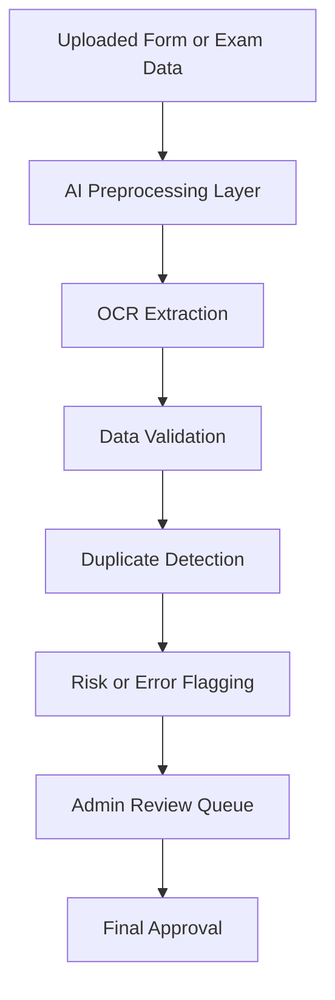
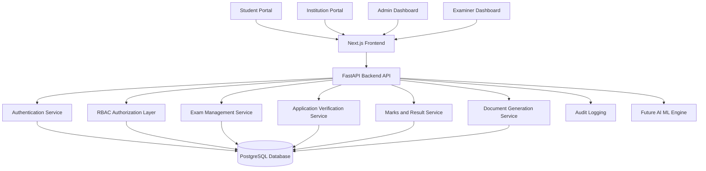
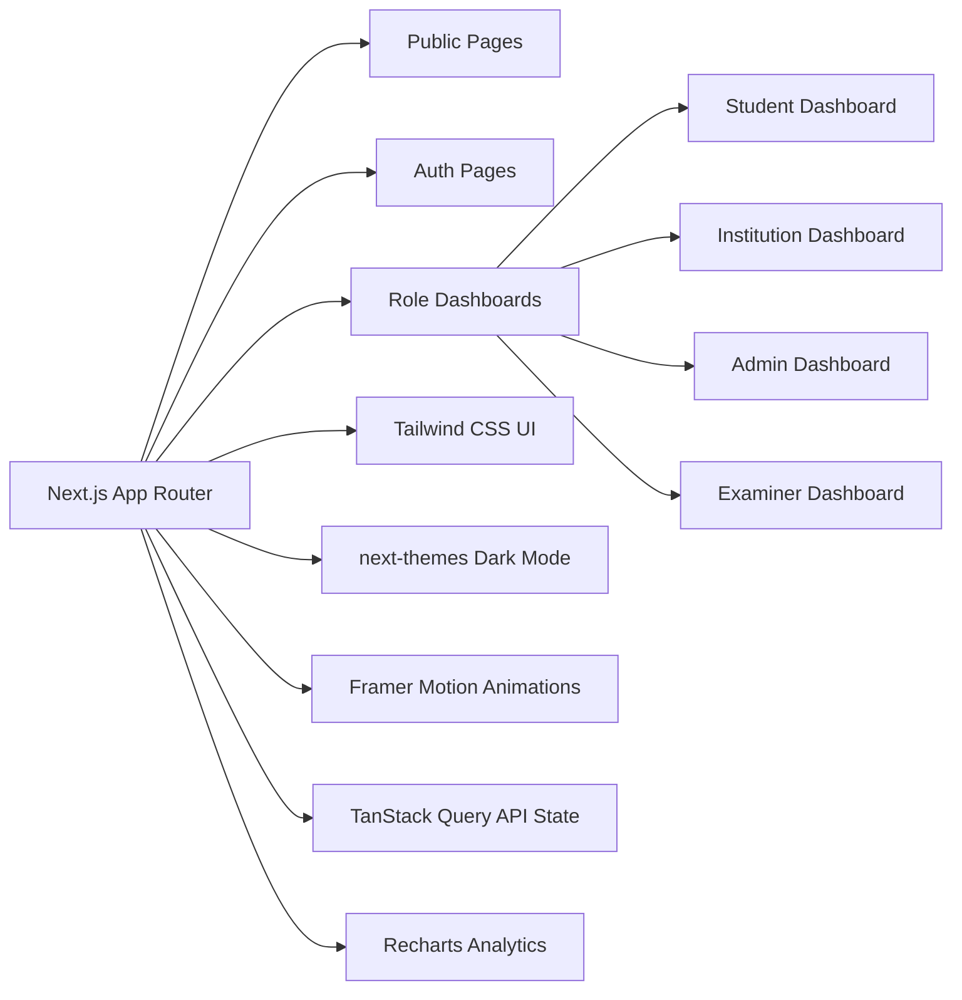
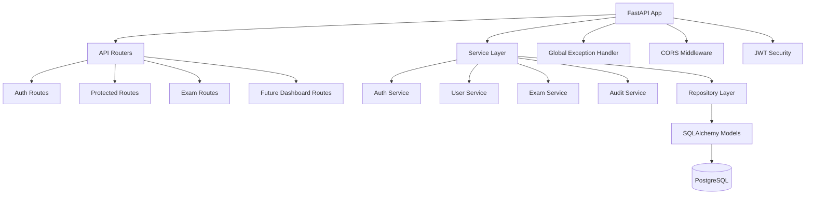
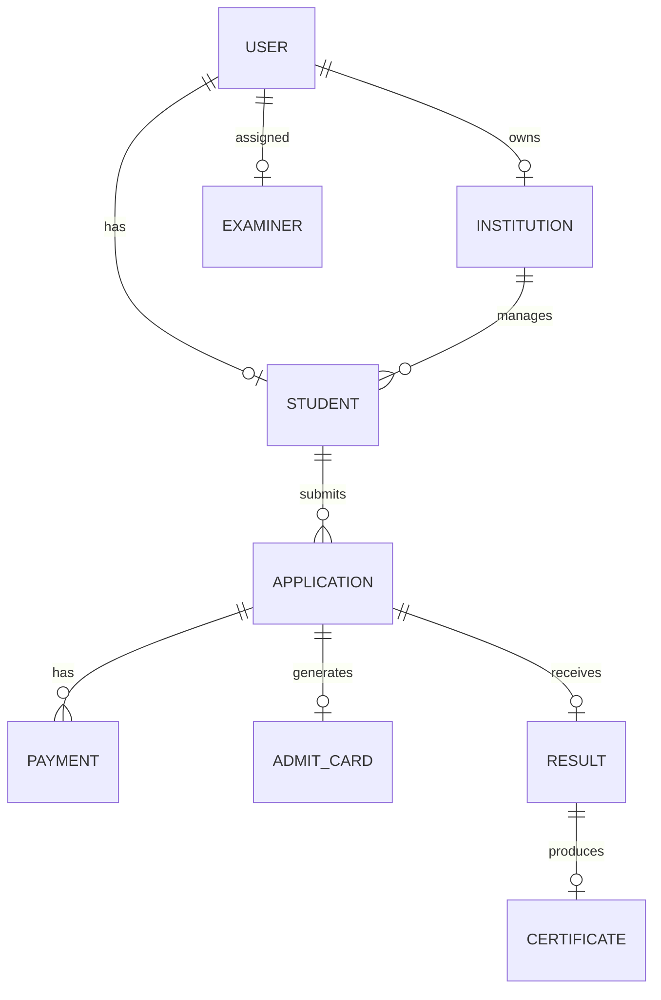
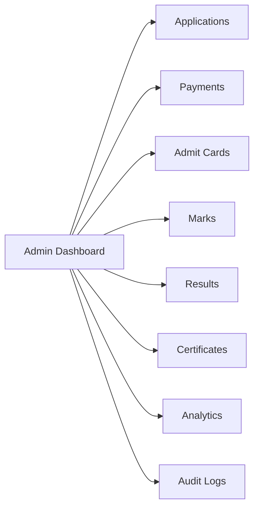

<p align="center">
  
</p>

<p align="center">
  
  
  
  
</p>

<p align="center">
  
  
  
  
  
  
  
  
</p>

<p align="center">
  
</p>

---

# 🎓 ExamFlow

> **Application → Verification → Admit Card → Examination → Marks → Result → Certificate**

**ExamFlow** is a full-scale examination automation platform built by **M.B. Technosoft Pvt Ltd** for cultural, academic, art, and skill-based examination bodies such as **Bangiya Sangeet Parishad**.

It is designed to replace manual form handling, paper-based verification, admit card preparation, marks entry, result publishing, and certificate generation with a secure, scalable, and role-based digital workflow.

---

# 🧠 Core Idea

Most examination bodies still run on disconnected manual processes.

ExamFlow transforms that entire workflow into one centralized digital platform where:

- Students can register online.
- Institutions can manage candidates.
- Admins can verify applications.
- Examiners can enter marks securely.
- Admit cards can be generated digitally.
- Results can be processed faster.
- Certificates can be issued with reduced error.

The goal is simple:

> **Reduce manual workload, prevent data-entry mistakes, and make examination administration faster, cleaner, and more transparent.**

---

# 🎯 Problem Statement

Many examination organizations still depend on paper forms, Excel sheets, manual verification, offline communication, and repeated data entry.

This creates major operational problems:

## For Students

- ❌ Delayed registration confirmation  
- ❌ Mistakes in names, subjects, centers, and certificates  
- ❌ No transparent application status  
- ❌ Difficulty collecting admit cards and results  
- ❌ Dependency on manual office communication  

## For Institutions

- ❌ Repeated candidate data collection  
- ❌ Manual bulk submission work  
- ❌ Difficulty tracking fees and approvals  
- ❌ High chance of duplicate or incorrect records  
- ❌ No centralized dashboard for exam operations  

## For Administrators

- ❌ Heavy workload during exam season  
- ❌ Manual verification of thousands of forms  
- ❌ Paper-based admit card and certificate preparation  
- ❌ Slow marks compilation and result publishing  
- ❌ No proper audit trail or accountability  

---

# 💡 ExamFlow Solution

ExamFlow provides a complete digital examination automation layer that manages the full exam lifecycle from application to certification.

It helps organizations:

- ✅ Digitize student and institution registration  
- ✅ Automate application verification workflows  
- ✅ Manage exam sessions, subjects, grades, fees, and centers  
- ✅ Generate admit cards, receipts, results, and certificates  
- ✅ Secure every action with role-based access control  
- ✅ Maintain clean database records with audit logs  
- ✅ Reduce operational delays and human errors  

---

# 🏆 Built For

<p align="center">
  
  
  
</p>

ExamFlow is suitable for:

- Cultural examination boards  
- Music and fine arts institutions  
- Academic examination bodies  
- Skill-based certification organizations  
- Training centers and affiliated institutions  
- Multi-branch educational administration systems  

---

# 🔥 Why ExamFlow Matters

| Manual Exam System | ExamFlow Digital System |
|---|---|
| Paper forms and handwritten data | Online application and structured records |
| Repeated data entry | Single source of truth |
| Manual fee verification | Digital fee and payment workflow |
| Offline admit card preparation | Auto-generated admit cards |
| Manual marks compilation | Structured marks entry and result processing |
| Certificate spelling mistakes | Verified data-driven certificate generation |
| No proper audit trail | Secure logs and role-based actions |
| Slow admin workflow | Centralized command dashboard |

---

# 🚀 Core Workflow

```mermaid
graph TD
    A[Student Registration] --> B[Application Submission]
    B --> C[Admin Verification]
    C --> D[Fee Validation]
    D --> E[Exam Session Allocation]
    E --> F[Admit Card Generation]
    F --> G[Examination Conducted]
    G --> H[Marks Entry by Examiner]
    H --> I[Result Processing]
    I --> J[Certificate Generation]
    J --> K[Digital Record Archive]
````

---

# 🧩 Platform Modules

## 👤 Student Module

* Student registration
* Login and profile management
* Exam application submission
* Subject and grade selection
* Admit card access
* Result viewing
* Certificate download

## 🏫 Institution Module

* Institution registration
* Pending approval workflow
* Student management
* Bulk candidate submission
* Application tracking
* Fee and exam status overview

## 🛡️ Admin Module

* User and role management
* Student verification
* Institution approval
* Exam session management
* Subject and grade configuration
* Fee structure management
* Result publishing
* Certificate control

## 🧑‍🏫 Examiner Module

* Secure examiner login
* Assigned candidate list
* Marks entry
* Marks validation
* Submission tracking
* Role-restricted access

## 👨‍👩‍👧 Guardian Module

* Guardian-linked student access
* Application visibility
* Admit card and result tracking
* Communication support

## 👑 Super Admin Module

* Full system control
* Admin account management
* Global settings
* Audit logs
* Security monitoring
* Organization-level configuration

---

# 🧠 Smart Examination Automation Flow

ExamFlow is not just a CRUD system. It is designed as a full exam operations engine.

```mermaid
graph LR
    A[Application Data] --> B[Validation Engine]
    B --> C[Verification Queue]
    C --> D[Approval Workflow]
    D --> E[Exam Allocation]
    E --> F[Document Generator]
    F --> G[Marks Processing]
    G --> H[Result Engine]
    H --> I[Certificate Pipeline]
```

---

# 🤖 AI/ML Expansion Roadmap

The current foundation is built first with secure backend, database, authentication, and role structure.

Future AI/ML workflows can be added on top of this foundation.

## Planned AI/ML Capabilities

* OCR-based handwritten form scanning
* Duplicate student detection
* Anomaly detection in marks entry
* Suspicious result pattern detection
* Automated document verification
* AI-based query assistant for students and admins
* Predictive exam center load estimation
* Smart certificate validation and fraud detection



---

# 🏗️ System Architecture



---

# 🖥️ Frontend Architecture



---

# ⚙️ Backend Architecture



---

# 🗄️ Database Foundation

ExamFlow already includes a complete database foundation designed for real examination workflows.

## Current Database Highlights

* 21 SQLAlchemy models
* UUID primary keys
* Enums for controlled states
* Timestamp mixins
* Soft-delete support
* Indexed fields
* Relationship mapping
* Alembic migration support
* Development seed data
* Audit-ready structure



---

# 🔐 Authentication & Authorization

ExamFlow includes a complete authentication and authorization layer.

## Implemented Security Features

* JWT-based authentication
* HS256 token signing
* PBKDF2-SHA256 password hashing
* 260,000 hashing iterations
* Email or phone-based login
* Role-Based Access Control
* Secure dependency injection
* Protected route guards
* Audit logging for critical actions
* Transaction-safe user creation
* Rollback safety during profile creation

## Supported Roles

| Role          | Access Level                          |
| ------------- | ------------------------------------- |
| `super_admin` | Full platform control                 |
| `admin`       | Exam and user administration          |
| `examiner`    | Marks entry and assigned evaluation   |
| `student`     | Applications, admit cards, results    |
| `institution` | Institution-side candidate management |
| `guardian`    | Linked student visibility             |

---

# 🧪 Current Completed Features

## ✅ Monorepo Foundation

* npm workspace structure
* `apps/web` frontend app
* `apps/api` backend app
* Shared packages
* Config packages
* Documentation directory
* Infrastructure directory

## ✅ Frontend Foundation

* Next.js App Router
* TypeScript support
* Tailwind CSS
* Premium dashboard UI foundation
* Light and dark mode
* Framer Motion support
* Recharts support
* TanStack Query support

## ✅ Backend Foundation

* FastAPI app initialization
* Health endpoints
* Global exception handling
* Environment-based CORS setup
* Clean architecture structure
* Repository and service layer
* API routing foundation

## ✅ Database Foundation

* SQLAlchemy 2.x setup
* PostgreSQL support
* Alembic migrations
* 21-model schema foundation
* UUID primary keys
* Enums and relationships
* Indexes
* Soft delete mixins
* Timestamp mixins

## ✅ Authentication Layer

* Student registration
* Institution registration
* Login endpoint
* Current user endpoint
* Logout endpoint
* Role-based protected routes
* Super-admin-only route
* Admin-only route
* Authenticated-only route
* Password hashing
* JWT creation and validation
* Login success and failure audit logs
* Password change validation

## ✅ Testing

* Health endpoint tests
* Database metadata tests
* Model import tests
* Password hashing tests
* JWT creation and decoding tests
* Registration schema validation tests
* Login schema validation tests
* User response schema tests
* Password change validation tests

---

# 📂 Monorepo Structure

```text
examflow-mbtechnosoft/
├── apps/
│   ├── web/
│   │   ├── app/
│   │   ├── components/
│   │   ├── lib/
│   │   ├── public/
│   │   └── package.json
│   │
│   └── api/
│       ├── app/
│       │   ├── api/
│       │   ├── core/
│       │   ├── db/
│       │   ├── models/
│       │   ├── schemas/
│       │   ├── services/
│       │   └── main.py
│       ├── alembic/
│       ├── tests/
│       ├── requirements.txt
│       └── alembic.ini
│
├── packages/
│   ├── shared/
│   ├── ui/
│   └── config/
│
├── docs/
│   ├── auth-api.md
│   ├── auth-curl-examples.md
│   ├── architecture.md
│   ├── security.md
│   └── deployment.md
│
├── infra/
├── .env.example
├── docker-compose.yml
├── package.json
└── README.md
```

---

# 🧰 Tech Stack

## Frontend

| Technology         | Purpose                        |
| ------------------ | ------------------------------ |
| Next.js App Router | Modern web application routing |
| TypeScript         | Type-safe frontend development |
| Tailwind CSS       | Utility-first responsive UI    |
| next-themes        | Light and dark mode            |
| Framer Motion      | Smooth animations              |
| Recharts           | Dashboard analytics charts     |
| TanStack Query     | API data fetching and caching  |

## Backend

| Technology     | Purpose                              |
| -------------- | ------------------------------------ |
| FastAPI        | High-performance backend API         |
| Pydantic       | Request and response validation      |
| SQLAlchemy 2.x | ORM and database models              |
| Alembic        | Database migrations                  |
| PostgreSQL     | Production-ready relational database |
| pytest         | Backend testing                      |
| Uvicorn        | ASGI server                          |

## Tooling

| Tool           | Purpose                     |
| -------------- | --------------------------- |
| npm workspaces | Monorepo package management |
| Docker Compose | Local PostgreSQL setup      |
| ESLint         | Frontend linting            |
| Prettier       | Code formatting             |
| pytest         | Backend test runner         |

---

# 🚀 Local Setup

## 1. Clone and Configure Environment

```bash
git clone <your-repository-url>
cd examflow-mbtechnosoft
cp .env.example .env
```

---

## 2. Install Frontend Dependencies

```bash
npm install
```

---

## 3. Run Frontend

```bash
npm run dev:web
```

Frontend runs at:

```text
http://localhost:3000
```

---

## 4. Setup Backend Python Environment

### macOS / Linux

```bash
cd apps/api
python3.11 -m venv .venv
source .venv/bin/activate
pip install -r requirements.txt
cp ../../.env.example .env
```

### Windows PowerShell

```powershell
cd apps/api
python -m venv .venv
.venv\Scripts\Activate.ps1
pip install -r requirements.txt
Copy-Item ../../.env.example .env
```

---

## 5. Run PostgreSQL with Docker

```bash
docker compose up -d postgres
```

Optional pgAdmin:

```bash
docker compose --profile admin up -d pgadmin
```

---

## 6. Run Alembic Migration

From `apps/api`:

```bash
alembic revision --autogenerate -m "initial database schema"
alembic upgrade head
```

---

## 7. Seed Development Data

From `apps/api`:

```bash
python -m app.db.seed
```

This creates development accounts:

| Role        | Email                         | Password      |
| ----------- | ----------------------------- | ------------- |
| Super Admin | `superadmin@mbtechnosoft.com` | `Admin@12345` |
| Admin       | `admin@mbtechnosoft.com`      | `Admin@12345` |
| Examiner    | `examiner@mbtechnosoft.com`   | `Admin@12345` |

Seed data also includes:

* Exam subjects
* Exam sessions
* Exam centres
* Grade levels
* Fee structures

---

## 8. Run Backend API

From `apps/api`:

```bash
uvicorn app.main:app --reload --host 0.0.0.0 --port 8000
```

Backend runs at:

```text
http://localhost:8000
```

Swagger API docs:

```text
http://localhost:8000/docs
```

---

# 📡 API Overview

Base URL:

```text
http://localhost:8000/api/v1
```

## Health Routes

| Method | Endpoint         | Purpose                |
| ------ | ---------------- | ---------------------- |
| GET    | `/`              | Root health check      |
| GET    | `/health`        | Backend health check   |
| GET    | `/api/v1/health` | Versioned health check |

## Authentication Routes

| Method | Endpoint                     | Purpose                        |
| ------ | ---------------------------- | ------------------------------ |
| POST   | `/auth/register/student`     | Register student               |
| POST   | `/auth/register/institution` | Register institution           |
| POST   | `/auth/login`                | Login with email or phone      |
| GET    | `/auth/me`                   | Get current authenticated user |
| POST   | `/auth/logout`               | Stateless JWT logout           |

## Protected Routes

| Method | Endpoint                        | Access             |
| ------ | ------------------------------- | ------------------ |
| GET    | `/protected/authenticated-only` | Any logged-in user |
| GET    | `/protected/admin-only`         | Admin only         |
| GET    | `/protected/super-admin-only`   | Super admin only   |

---

# 🔎 Authentication Quick Test

## Register Student

```bash
curl -X POST "http://localhost:8000/api/v1/auth/register/student" \
  -H "Content-Type: application/json" \
  -d '{
    "full_name": "Test Student",
    "email": "test@example.com",
    "password": "Test@12345",
    "confirm_password": "Test@12345"
  }'
```

## Login

```bash
curl -X POST "http://localhost:8000/api/v1/auth/login" \
  -H "Content-Type: application/json" \
  -d '{
    "identifier": "test@example.com",
    "password": "Test@12345"
  }'
```

## Get Current User

```bash
curl -X GET "http://localhost:8000/api/v1/auth/me" \
  -H "Authorization: Bearer <access_token>"
```

## Test Admin-Only Route

```bash
curl -X GET "http://localhost:8000/api/v1/protected/admin-only" \
  -H "Authorization: Bearer <access_token>"
```

---

# 🧪 Testing Strategy

ExamFlow is designed with proper testing and debugging in mind.

## Backend Tests

```bash
cd apps/api
pytest
```

Current coverage includes:

* Password hashing
* Password verification
* JWT token creation
* JWT token decoding
* Registration schema validation
* Login schema validation
* User response schemas
* Password change validation
* Health endpoints
* Database metadata imports

## Frontend Checks

```bash
npm run lint
npm run build
```

## Recommended Full Local Validation

```bash
# Backend
cd apps/api
python -m compileall .
pytest

# Frontend
cd ../../
npm run lint
npm run build
```

---

# 🏆 Demo Flow

Use this flow when presenting ExamFlow:

1. Show the problem with manual examination workflows.
2. Explain how ExamFlow digitizes the full exam lifecycle.
3. Open the frontend dashboard.
4. Show role-based login.
5. Register a student.
6. Login and fetch current user details.
7. Show protected admin route access.
8. Explain the database schema foundation.
9. Show Swagger API docs.
10. Explain future modules: exam setup, admit cards, marks, results, certificates.
11. End with scalability and AI/ML roadmap.

---

# 🧠 Judge-Friendly Explanation

ExamFlow can be explained in one line:

> **ExamFlow is a secure digital operating system for examination bodies that converts manual registration, verification, admit card, marks, result, and certificate workflows into a centralized automated platform.**

---

# 🚧 Intentionally Not Implemented Yet

The current repository contains the monorepo foundation and base setup.

The following business workflows are planned next:

* Payment gateway business flow
* Razorpay order creation
* Razorpay payment verification
* Razorpay webhook handling
* AI/ML business workflow execution
* PDF generation pipeline
* Receipt generation
* Admit card generation
* Certificate generation
* Full dashboard APIs
* Production analytics endpoints
* Password reset flow
* Email verification flow
* Token refresh endpoint
* Server-side token blacklisting

---

# 🛣️ Roadmap

## Phase 1: Foundation

* [x] Monorepo setup
* [x] Next.js frontend foundation
* [x] FastAPI backend foundation
* [x] PostgreSQL Docker setup
* [x] SQLAlchemy model foundation
* [x] Alembic migration setup
* [x] JWT authentication
* [x] RBAC authorization
* [x] Development seed data
* [x] Backend tests

## Phase 2: Core Exam Setup

* [ ] Exam session APIs
* [ ] Subject management APIs
* [ ] Grade management APIs
* [ ] Fee management APIs
* [ ] Exam center management APIs
* [ ] Application form configuration

## Phase 3: Student and Institution Workflow

* [ ] Student application flow
* [ ] Institution approval flow
* [ ] Bulk student upload
* [ ] Application verification queue
* [ ] Application status tracking

## Phase 4: Payment and Documents

* [ ] Razorpay order creation
* [ ] Payment verification
* [ ] Receipt generation
* [ ] Admit card generation
* [ ] Certificate generation
* [ ] Secure PDF download

## Phase 5: Result System

* [ ] Examiner assignment
* [ ] Marks entry
* [ ] Marks validation
* [ ] Result calculation
* [ ] Result publishing
* [ ] Certificate eligibility logic

## Phase 6: AI/ML Enhancement

* [ ] OCR form extraction
* [ ] Duplicate candidate detection
* [ ] Marks anomaly detection
* [ ] Smart admin assistant
* [ ] Document fraud detection
* [ ] Predictive exam center planning

---

# 📊 Future Dashboard Vision

The final dashboard will work like an **Examination Command Center**.

It will show:

* Total students
* Total institutions
* Pending applications
* Approved applications
* Rejected applications
* Payment status
* Admit card status
* Marks entry progress
* Result publication status
* Certificate generation status
* Role-wise system activity
* Audit logs
* Exam session analytics



---

# 🔐 Security Principles

ExamFlow follows secure-by-design principles:

* Passwords are never stored in plain text.
* JWT tokens are used for authenticated access.
* Routes are protected by role-based access.
* User actions are audit logged.
* Database operations use transaction safety.
* CORS is configured using environment variables.
* Sensitive environment values are kept outside code.
* Authorization checks are handled through backend dependencies.

---

# 📚 Documentation

Detailed documentation is available inside the `docs/` directory.

## API Guides

* `docs/auth-api.md`
* `docs/auth-curl-examples.md`

## Technical Docs

* `docs/architecture.md`
* `docs/security.md`
* `docs/deployment.md`

---

# 🧾 Current Status

ExamFlow is currently at the **enterprise foundation stage**.

This means the project already has:

* A proper monorepo architecture
* A working frontend foundation
* A working backend foundation
* A database schema foundation
* Authentication and authorization
* Seed users
* Tests
* Documentation
* Docker-based PostgreSQL setup

The next major step is to build the **core examination setup APIs** for:

* Exam sessions
* Subjects
* Grades
* Fees
* Centers
* Application workflows

---

# 👥 Company

<p align="center">
  
</p>

**ExamFlow** is developed as part of the digital examination automation vision of **M.B. Technosoft Pvt Ltd**.

---

# 📌 Final Vision

ExamFlow is not just an examination portal.

It is a complete digital backbone for examination bodies.

It helps institutions reduce manual effort, helps administrators work faster, helps students access information transparently, and helps examination boards build a cleaner, more reliable, and scalable digital future.

> **From paper-heavy examination management to intelligent digital exam operations — that is ExamFlow.**

---

<p align="center">
  
</p>

