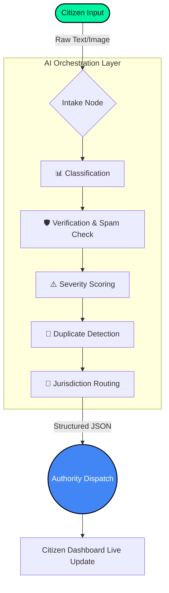

<div align="center">


[](#)
[](#)
[](#)
[](#)

<br/>


<br/>


</div>

---

## 🌍 The Vision: Citizen Voice → AI Intelligence → Government Action

**CivicLink** is a high-performance, AI-orchestrated civic infrastructure platform designed to eradicate the inefficiencies of public complaint handling. By converting chaotic, unstructured citizen grievances into structured, actionable civic tasks, CivicLink brings speed, transparency, and absolute accountability to urban governance.

---

## 🏆 United Nations SDGs Alignment

CivicLink was engineered specifically to tackle global challenges outlined by the UN, making it a prime contender for the **Google Solution Challenge**.

| 🏙️ **SDG 11: Sustainable Cities** | ⚖️ **SDG 16: Strong Institutions** | 🚀 **SDG 9: Innovation & Infrastructure** |
| :--- | :--- | :--- |
| Accelerates response times for critical urban infrastructure, sanitation, and public safety failures. | Eliminates bureaucratic black holes through transparent tracking and institutional accountability. | Modernizes outdated governmental workflows using scalable, cutting-edge AI software architecture. |

---

## 🛑 The Problem vs. 💡 The CivicLink Solution

| The Broken Status Quo (Without CivicLink) | The Intelligent Future (With CivicLink) |
| :--- | :--- |
| ❌ **Black-Box Tracking:** Citizens submit complaints and never hear back. | ✅ **Total Transparency:** Live status tracking from submission to resolution. |
| ❌ **Manual Routing:** Forms sit on desks waiting for human clerks to forward them. | ✅ **Autonomous Dispatch:** AI instantly routes the issue to the exact jurisdiction. |
| ❌ **System Flooding:** Duplicate complaints and spam overwhelm authorities. | ✅ **Smart Verification:** AI filters spam and clusters duplicate reports automatically. |
| ❌ **No Triage:** A broken streetlight is treated with the same urgency as a burst water main. | ✅ **Severity Scoring:** Critical infrastructure failures are flagged for immediate response. |

---

## 🧠 Core Innovation: Explainable AI Pipeline

Most civic portals treat AI as a gimmick. CivicLink treats it as an **Explainable Workflow**. We don't use a black-box model; every complaint moves through a highly visible, judge-friendly AI pipeline.



### 🧩 Step-by-Step AI Processing

| Step | AI Node | Execution Logic |
| --- | --- | --- |
| **1** | `Intake` | Ingests and normalizes raw user text into structured data. |
| **2** | `Classification` | Categorizes the issue (e.g., Roadway, Sanitation, Water Supply, Safety). |
| **3** | `Verification` | Validates legitimacy; aggressively filters out spam or incomplete data. |
| **4** | `Severity` | Assigns algorithmic priority (`LOW`, `MEDIUM`, `HIGH`, `CRITICAL`). |
| **5** | `Deduplication` | Prevents database flooding by linking visually/textually identical reports. |
| **6** | `Routing` | Maps the classified issue to the exact municipal department ID. |

---

## 🏗️ System Architecture & Tech Stack

CivicLink utilizes a decoupled, modern full-stack architecture built for scale.

* **Frontend (Next.js 14, TailwindCSS):** Delivers a highly responsive, accessible interface for both citizens (Portal) and authorities (Command Center).
* **Backend (FastAPI, Python):** Powers the high-throughput REST API, handling secure request validation and AI model orchestration.
* **Database (PostgreSQL via Prisma):** Maintains strict relational integrity for grievance histories, agency mapping, and audit logs.
* **AI Engine (LangGraph/LLMs):** Orchestrates the multi-agent reasoning steps required for explainable complaint parsing.

---

## 🔥 Key Features

### 👤 For Citizens: The Empowerment Portal

* **Frictionless Submission:** Report an issue in under 30 seconds.
* **Explainable Receipts:** Receive an AI-generated summary showing exactly how the system understood the complaint.
* **Live Tracking:** Watch the ticket move from "Pending" to "Assigned" to "Resolved."

### 🏛️ For Authorities: The Command Center

* **Triage Dashboard:** Instantly view a heat-map of critical vs. low-priority issues.
* **AI Decision Logs:** See *why* the AI assigned a specific severity score to a ticket.
* **Analytics Overview:** Track department efficiency, resolution rates, and category spikes.

---

## 📡 API Reference

Base URL: `http://localhost:8000/api/v1`

| Method | Endpoint | Description |
| --- | --- | --- |
| `POST` | `/ingest` | Submit a raw complaint for AI pipeline processing. |
| `GET` | `/grievances` | Fetch paginated, filtered complaints. |
| `PATCH` | `/grievances/{id}/status` | Update resolution state (Authority only). |
| `GET` | `/analytics` | Retrieve aggregate metrics for the dashboard. |
| `GET` | `/health` | System diagnostics and AI endpoint status. |

---

## 🛠️ Local Setup & Deployment

### 1. Clone the Repository

```bash
git clone [https://github.com/YOUR_USERNAME/CivicLink.git](https://github.com/YOUR_USERNAME/CivicLink.git)
cd CivicLink

```

### 2. Backend Environment (FastAPI)

```bash
cd backend
python -m venv .venv
source .venv/bin/activate  # On Windows use: .venv\Scripts\activate
pip install -r requirements.txt

# Create your .env file
echo "DATABASE_URL=your_postgresql_url" > .env
echo "DEMO_MODE=true" >> .env

# Run the server
uvicorn main:app --reload

```

*Backend running at: `http://localhost:8000` | Swagger Docs: `http://localhost:8000/docs*`

### 3. Frontend Environment (Next.js)

```bash
cd ../frontend
npm install

# Create your .env file
echo "NEXT_PUBLIC_API_BASE_URL=http://localhost:8000/api/v1" > .env.local

# Boot the application
npm run dev

```

*Frontend running at: `http://localhost:3000*`

---

## 🧪 Testing Protocol

CivicLink is built with robust test coverage to ensure enterprise-grade reliability.

```bash
# Backend Testing
cd backend
pytest -v

# Frontend Testing & Validation
cd frontend
npm run lint
npm run build

# Database Schema Validation
npx prisma validate

```

---

## 🚀 The Future Roadmap

* [ ] **Multilingual Support:** Native language complaint parsing via LLMs.
* [ ] **WhatsApp Integration:** Submit complaints directly via conversational bots.
* [ ] **Geospatial Clustering:** Predictive mapping to identify failing infrastructure hot-spots before they break.
* [ ] **Computer Vision:** Automated verification of pothole/trash severity via uploaded images.

---

## 👥 The Engineering Team

| Name | Role | Focus |
| --- | --- | --- |
| **Shreyan Mitra** | Project Lead / Full-Stack | Product Vision, Architecture, Presentation |
| **Priyanshu Roy** | Backend / AI Architecture | API Design, LangGraph Orchestration |
| **Mayank Sharma** | Frontend / UI Engineering | Next.js Components, User Experience |
